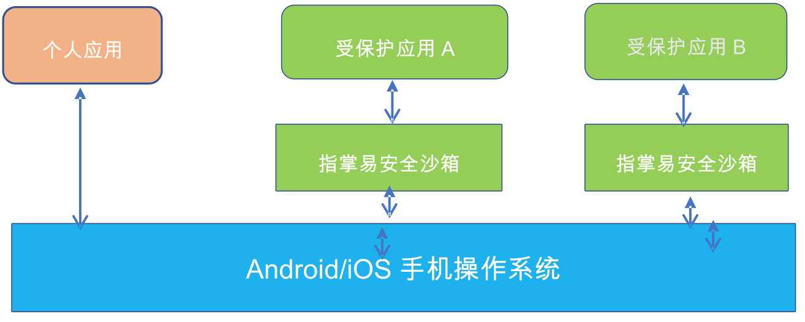

# EMM
EMM企业移动管理平台

## 指掌易EMM解析
指掌易EMM主要包括沙箱引擎、沙箱控制器和APP-SDK组成。
* 沙箱引擎（Sandbox Engine）SDK：由需要沙箱化的应用来集成，核心是沙箱引擎库。
* 沙箱控制器 （Sandbox Controller）SDK：由独立于沙箱之外的管控客户端集成，实现对沙箱应用的权限、行为、数据的管理。
* APP-SDK：是Controller-SDK的一个子集+Sandbox Engine sdk，使得应用自身可动态的执行相应的安全策略。

指掌易的安全功能，建立在独有的安全应用容器（沙箱）基础上。一个普通应用安装前，指掌易自动对应用宝进行“加壳”，应用启动后，运行在指掌易的虚拟容器里，由于应用运行在沙箱环境中，因此应用的所有行为均在沙箱的监控下，针对需要管控的行为进行适配和根据功能配置对该行为进行管控，从而做到自动化的安全防护，并能够在系统无感知的前提下对应用进行管理，有效保证系统和其他应用的稳定性。

移动端重打包流程

1. 解析原始包，获取对应信息
2. 创建新的包，添加引擎SDK，打包形成新的沙箱包
3. 签名（用户可以自行签名，也可以使用默认证书签名）
4. 得到可安装运行的沙箱应用

管控功能分为DLP、分享管控、解密、VPN、隐私管控等

|功能模块 |应用功能名称 |
| ----| ----|
|  复制黏贴  |  仅允许沙箱应用内部复制粘贴、允许沙箱应用与非沙箱应用间复制粘贴   |
|  防截屏 |  禁止使用系统截屏、禁止应用截屏录屏  |
|  水印功能 |  应用界面添加水印、设置为动态水印内容（用户名）、设置为静态水印内容、设置水印文字大小、设置水印边框大小、设置水印文字颜色、设置水印旋转角度|
|通知栏|允许通知栏消息|
|iOS分享|允许AirDrop分享、通过其他应用打开数据文件、是否允许iCloud云备份与同步|
|禁止通过非沙箱应用分享|禁止分享到系统应用、禁止分享到非沙箱的第三方应用|
|禁止通过沙箱应用分享|禁止分享到沙箱应用|
|禁止沙箱应用作为分享工具|禁止被外部应用分享|
|禁止通过该应用分享通过其他方式记录的敏感信息|允许访问多媒体（相册、视频、音频）|
|系统功能调用|允许使用蓝牙传输、允许使用打印功能、允许调用邮件客户端发送邮件、允许获取地理位置、允许录音、允许调用摄像头（拍照和摄影）|
|文件加密|启用文件加密、AES256、SM4加密|
|VPN：深信服or指掌易|是否启用SSL VPN配置、选择VPN提供商、VPN服务器地址预配置、VPN服务器端口|
|无痕控制|无痕功能控制|
|后台运行|后台运行、后台自动退出时间、锁屏自动退出时间|
|网络管控&审计|URL黑白名单、使用URL黑白名单管控、URL访问记录审计、使用移动网络、允许使用wifi、wifi bssid黑白名单、使用Bssid黑白名单控制上网、敏感词过滤（直接对应用封装实现）、敏感词过滤（通过对输入法封装实现）、敏感词审计（直接对应用封装实现）、敏感词审计（通过对输入法封装实现）、聊天记录数据收集、聊天多媒体文件记录|

权限管控流程

针对应用调用camera、录音、打印等功能时（拦截之后不需和系统交互）
1. 应用运行，监控识别需要管控的应用的功能调用
2. 当权限需要管控时，根据功能配置判断是否授权使用
3. 允许则放行，否则拦截

其他行为管控流程

针对应用上网行为、加解密、VPN等其他行为时（管控处理之后仍需和系统交互）
1. 应用运行，监控应用的行为是否需要管控
2. 当行为需要管控时，根据功能配置判断是否授权使用
3. 允许则放行，否则进行管控

文件透明加密

通过沙箱的实现机制，拦截系统文件的读写等相关操作，利用管理端生成并保存的秘钥和相关算法针对沙箱应用生成的文件进行写入加密的控制，实现落地数据的加密存储，保障应用数据的安全性。
同时针对应用生成的加密文件进行读取解密，实现应用读取数据透明化的控制，用户体验无感知。相同设备上沙箱应用使用相同密钥。

实现过程
1. 客户端生成并存储设备自身的密钥
2. 应用根据密钥、加密策略（加密文件、算法等）对应用进行读取解密、写入加密的控制

密钥生成和存储
本地生成密钥与存储：客户端根据自身设备信息（IMEI等）生成密钥并保存在设备中

加密策略
加密策略中包括加密配置信息和加密算法，应用根据配置信息中允许加解密的数据进行加解密控制，其他数据保持明文。

加密配置

加密配置中包含加密目录名单和加密文件类型列表，执行时首先根据加密目录名单判断是否需要加密，若不在名单中，则再根据加密文件类型判断，目录名单优先级高于文件类型。

沙箱技术

自动封装技术（App Wrapping）
为应用提供一系列的安全管理和控制服务能力，对上层应用完全透明
* 对应用自动封装，无需二次开发，不破坏应用原有架构，对上层应用完全透明
* 无需Root/越狱实现安全沙箱，对APP进行安全保护
* 提供应用级安全隧道，传输数据加密能力

## VirtualApp源码分析
* [Android 双开沙箱 VirtualApp 源码分析（一）](https://blog.csdn.net/ganyao939543405/article/details/76146760)
* [VirtualApp解析](https://www.jianshu.com/nb/21276638)
* [VirtualApp源码分析——（一）VA启动](https://blog.csdn.net/weixin_35016347/article/details/80193017)
* [VirtualApp沙盒基本原理](https://blog.csdn.net/earbao/article/details/71156623)
* [Android虚拟化引擎VirtualApp探究](https://developer.aliyun.com/article/616978)
* [VirtualApp原理解析(1)--初始化及注入流程](https://blog.csdn.net/leif_/article/details/72420934)
* [VirtualApp框架--- Application启动过程](https://blog.csdn.net/suningning/article/details/52073191)

## 沙箱技术
* [基于虚拟化及重定向技术的Android沙箱的设计与实现](http://www.doc88.com/p-7129181636860.html)

## 加固技术
* [基于Android重打包的应用程序安全策略加固系统设计](https://www.doc88.com/p-2095552902950.html)
* [Android应用安全加固技术研究与实现](https://www.doc88.com/p-6981533664632.html)
* [Android应用安全加固技术研究与实现](https://www.doc88.com/p-6478639576884.html)
* [基于android应用的安全加固系统的设计与实现](https://www.doc88.com/p-7334990393423.html)
* [android 软件安全加固技术研究与实现](https://www.doc88.com/p-0909694508682.html)
* [基于android平台的so加固技术研究](https://www.doc88.com/p-5029750143826.html)
* [加密与加壳相结合的Android应用安全加固技术的研究与实现](https://www.doc88.com/p-9416474581678.html)
* [Android应用本地代码的安全加固及安全性评估
](https://www.doc88.com/p-9738410423907.html)

## 文件加密
* [Android平台下文件透明加密技术的研究与实现](https://www.doc88.com/p-1136394037185.html)
* [基于Android平台的文件透明加密的设计与实现
](https://www.doc88.com/p-7784997422678.html)

## 重打包
* [apk反编译，smali文件修改，重新打包](https://blog.csdn.net/wxk105/article/details/62231068)

## 防泄漏
* [面向移动智能终端的DLP系统设计与实现](https://www.doc88.com/p-1933536793694.html)

## 其他EMM厂商资料

* [用友](https://iuap.yonyoucloud.com/doc/mobile_emm.html#/md-build/mobile_emm/articles/emm/2-/ydgl.md?key=%E7%A7%BB%E5%8A%A8%E7%AE%A1%E7%90%86)
* [用友UMM](https://moli.yonyoucloud.com/molidoc/docs/ummdoc/34)
* [天畅移动信贷](https://www.techown.com/mf/mobile_credit.html)
* [深信服](https://www.sangfor.com.cn/product-and-solution/sangfor-security/emm)
* [京联云企业](http://www.pekall.com/index.html)
* [联信摩贝](http://www.trustmobi.com/zh/)
* [指掌易](https://www.zhizhangyi.com/pdt_emm.html)
